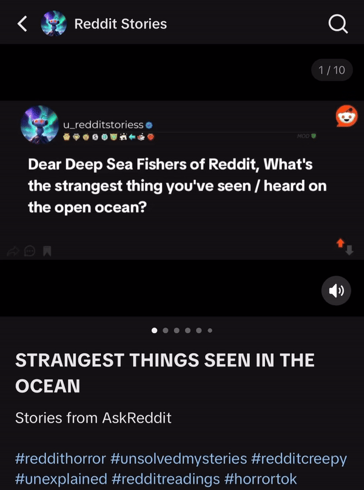

# VideoGenerator

**VideoGenerator** is a Python-based project designed to showcase creative automated video creation. This repository generates three types of videos, each with a unique theme and content format.

**While the code is public, it has not been designed in a way that allows is to be ready to use for users to be able to clone and generate videos independently.**

## Features

VideoGenerator produces the following types of Videos:

### Will You Push The Button?
   Creates a fun, decision-making game where viewers decide whether they would "push the button" based on an ethical dilemma or hypothetical situation.

   

     
   

   

      <a href="https://www.youtube.com/@BlueVsRedButton/shorts">Account with full video examples</a>
   

### Reddit TTS Story  
   Generates videos that feature a story from Reddit, narrated with text-to-speech, combined with engaging visuals.
   

     
   

   

      <a href="https://www.tiktok.com/@videos_exe">Account with full video examples</a>
   

### Reddit Horror Story Comments Slideshow
   Displays a collection of creepy or horror-themed comments from Reddit in a slideshow format.

   

     
   

   

      <a href="https://www.tiktok.com/@videos_exe">Account with full video examples</a>
   

## How it Works

Each type of VideoGenerator content follows its own unique pipeline:
1. **Reddit TTS Story Video**: 
   - Fetches a Reddit post (from subreddit and time frame of choosing).
   - Converts the text to speech.
   - Creates a Post title image.
   - Generates a video with background visuals and the TTS narration.

2. **Will You Push The Button?**: 
   - Fetches scenarios from [Will You Press The Button?](https://willyoupressthebutton.com)
   - Uses LLM to create image generation prompts, based off the scenarios, that will be fed into text to image AI
   - Feeds afore-mentioned prompts into text to image AI and generates Images
   - Creates text for each scenario
   - Generates a video with background visuals, audio and text
   - Speeds up video to be less than 60 seconds
   - Uploads to shorts using Google's Youtube Uploader API
     
3. **Reddit Horror Story Comments**: 
   - Scrapes horror-related Reddit comments.
   - Creates comment images for each reddit comment.

## Installation & Usage

While the code is public, the repository is not structured to allow cloning and direct use for generating videos. You are more than welcome to go through the code though.
